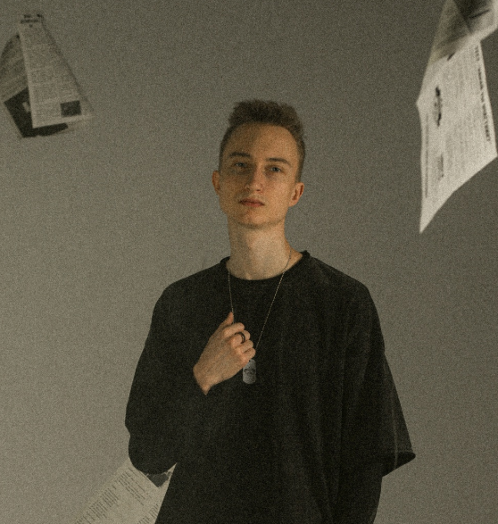

# Обо мне

<table data-header-hidden data-full-width="false"><thead><tr><th width="316"></th><th></th></tr></thead><tbody><tr><td></td><td>
<strong>Доленков Игорь</strong>

 <a href="https://t.me/storkych">tg</a>, <a href="https://vk.com/storkych">vk</a>, <a href="https://github.com/storkych">GitHub</a>: <mark style="background-color:blue;">@storkych</mark>

mail: storkych@gmail.com 
</td></tr></tbody></table>

### Образование



### Экономический лицей РЭУ им. Г. В. Плеханова

**Профиль**: "Цифровая экономика"

Год выпуска: 2021



### РЭУ им. Г. В. Плеханова

**Факультет**: "Высшая школа кибертехнологий, математики и статистики"\
**Направление**: "Математическое обеспечение и администрирование информационных систем"\
**Профиль**: "Системное и интернет программирование"

Год выпуска: 2025



### Мои проекты в сфере разработки игр

С 2020 года я начал интересоваться разработкой компьютерных игр и на данный момент имею за плечами 3 проекта на платформе Steam и более 10 проектов на платформе Яндекс Игры.


[gamedev.md](experience/gamedev.md)


### Мои web проекты

С 2019 года я начал интересоваться веб-разработкой и периодически реализую различные проекты (на заказ или для собственных целей).


[web.md](experience/web.md)


### Моё портфолио в медиа-сфере

Более 10 лет активно пользуюсь фото и видео редакторами и всегда готов применить свои навыки в процессе создания чего-либо.


[media.md](experience/media.md)


### Мой опыт в рамках Студенческого совета РЭУ

За период своего обучения в ВУЗе я принял участие в самых различных проектах и активностях, что помогло мне обрести организаторские навыки, а так же развить свои soft и hard скиллы.


[student.md](experience/student.md)

